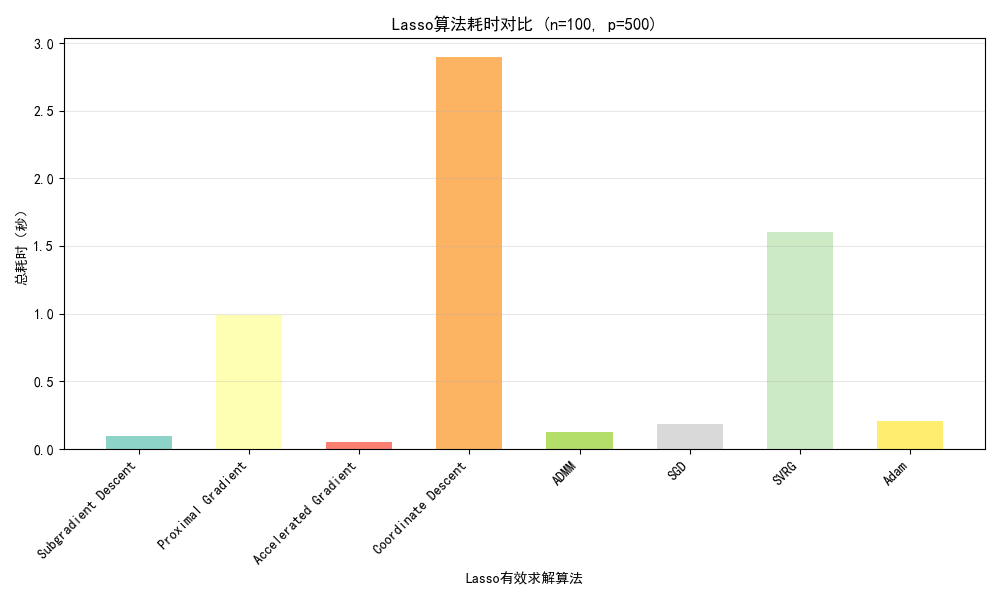
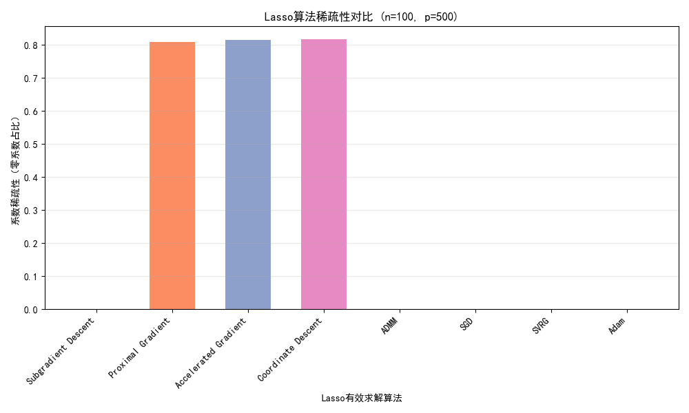
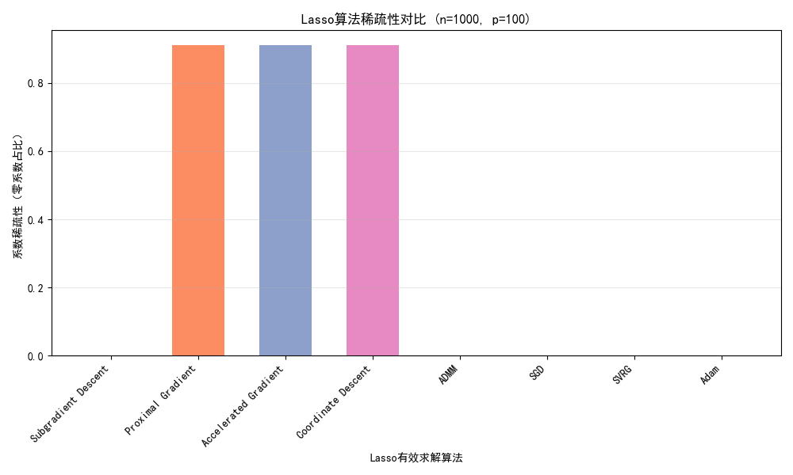

# 🔬 LASSO 回归优化算法对比实验

## 📌 项目简介

本实验系统实现了 **8 种不同的优化算法** 求解 LASSO（最小绝对收缩和选择算子）回归问题，通过全面的对比分析，为不同场景下的算法选择提供数据支撑和理论参考。

## 🎯 实验目标

| 目标 | 详细内容 |
|------|----------|
| **算法实现** | 实现 8 种针对 LASSO 问题的优化算法 |
| **场景覆盖** | 分析三种典型数据维度场景下的算法表现 |
| **多维评估** | 从计算效率、求解精度、稀疏性等维度全面评估 |

## 📊 实验场景

<div align="center">

| 场景类型 | 样本数 (n) | 特征数 (p) | 数据关系 | 应用特点 |
|:--------:|:----------:|:----------:|:--------:|:--------:|
| **高维小样本** | 100 | 500 | \( n < p \) | LASSO 核心应用场景 |
| **等维数据** | 500 | 500 | \( n = p \) | 常规回归场景 |
| **低维多样本** | 1000 | 100 | \( n > p \) | 大样本拟合场景 |

</div>

## ⚙️ 实验配置

### 🎛️ 参数设置
- **正则化参数**: \( \lambda = 0.1 \)
- **最大迭代次数**: \( 10^4 \)
- **收敛阈值**: \( 10^{-6} \)
- **学习率**: 
  - SGD / Adam: 0.001
  - 其他算法: 0.01

### 🔢 数据生成
```python
# 数据生成规则
X ∼ N(0, 1)                  # 特征矩阵，标准正态分布
β: 仅10%维度为非零值         # 真实系数，模拟稀疏性
y = Xβ + 0.1·N(0, 1)         # 标签向量，添加高斯噪声
```

## 🧮 实验算法

<div align="center">

| 算法类别 | 包含算法 | 主要特点 |
|:---------|:---------|:---------|
| **梯度类算法** | 次梯度下降、近端梯度下降、加速梯度下降 | 适配非光滑目标，软阈值处理 |
| **逐维度优化** | 坐标下降 | 高维场景高效，闭式解 |
| **分布式友好** | 交替方向乘子法 (ADMM) | 拆分约束，稳定性强 |
| **大规模数据** | SGD、SVRG、Adam | 批次计算，降低时间复杂度 |

</div>

## 📈 实验结果

### ⏱️ 计算效率分析

| 场景 | 最优算法 | 耗时 (秒) | 关键发现 |
|:-----|:---------|:----------|:---------|
| **高维小样本** | 加速梯度下降 | 0.053 | 坐标下降耗时最长 (2.894s) |
| **等维数据** | 加速梯度下降 | 0.045 | SGD 效率最低 (1.825s) |
| **低维多样本** | 加速梯度下降 | 0.020 | 与坐标下降几乎持平 |

**可视化对比：**
- 
- 
- 

### 📉 收敛速度分析

**收敛曲线对比：**


| 算法 | 迭代次数 (高维场景) | 收敛特点 |
|:-----|:-------------------|:---------|
| **坐标下降** | 130 | 最快，闭式解无需复杂迭代 |
| **加速梯度下降** | 390 | Nesterov加速，综合效率最优 |
| **随机梯度类** | >1800 | 梯度方差大，需更多迭代 |

**收敛分析核心结论：**
1. 坐标下降迭代次数最少，因逐维度闭式解无需复杂梯度迭代
2. 加速梯度下降借助 Nesterov 加速，迭代次数适中且单次耗时低
3. 随机梯度类算法因梯度方差大，需更多迭代次数才能收敛

### 🎯 稀疏性表现

| 场景 | 最优算法 | 零系数占比 | 稀疏性特点 |
|:-----|:---------|:-----------|:-----------|
| **高维小样本** | 坐标下降 | 81.6% | 完美契合 L1 正则要求 |
| **等维数据** | 近端梯度下降 | 90.2% | 稀疏化效果显著 |
| **低维多样本** | 坐标下降 | 91.0% | 低维数据更易稀疏化 |

**可视化对比：**
- 
- 
- 

## 🏆 算法推荐

<div align="center">

| 场景 | 🥇 最优算法 | 🥈 次优算法 | 推荐理由 |
|:-----|:-----------|:-----------|:---------|
| **高维小样本** (n < p) | **加速梯度下降** | 近端梯度下降 | 耗时最少、精度高、稀疏性好 |
| **等维数据** (n = p) | **坐标下降** | 加速梯度下降 | 迭代次数最少、精度最优 |
| **低维多样本** (n > p) | **坐标下降** | 加速梯度下降 | 耗时最短、迭代最少 |

</div>

## 🔍 核心发现

| 发现 | 说明 | 应用建议 |
|:-----|:-----|:---------|
| **通用最优算法** | 加速梯度下降在所有场景下表现均衡 | 适合工程落地，无需场景调整 |
| **场景专用算法** | 坐标下降在低维/等维场景最优 | 高维场景性能衰减明显 |
| **稀疏性差异** | 仅梯度类算法能有效产生稀疏解 | 选择算法时需考虑稀疏性需求 |
| **随机算法局限** | SGD类算法稀疏化效果失效 | 仅适合对稀疏性无要求的大规模场景 |

## 📁 项目结构

```
LASSO-Optimization-Comparison/
├── README.md                          # 项目说明文档
├── lasso不同算法下比较.pdf           # 完整实验报告
├── src/                              # 源代码目录
│   ├── algorithms.py                 # 8种算法实现
│   ├── data_generator.py             # 数据生成模块
│   └── utils.py                      # 工具函数
├── results/                          # 实验结果
│   ├── 图片1：高维小样本（100,500）耗时对比.png
│   ├── 图片2：等维数据（500,500）耗时对比.png
│   ├── 图片3：低维多样本（1000,100）耗时对比.png
│   ├── 图片4：收敛曲线对比（以100,500为例，核心场景）
│   ├── 图片5：高维小样本（100,500）稀疏性对比.png
│   ├── 图片6：等维数据（500,500）稀疏性对比.png
│   └── 图片7：低维多样本（1000,100）稀疏性对比.png
├── .gitignore                        # Git忽略配置
└── LICENSE                           # 开源许可证
```

## 📝 使用说明

1. **环境配置**
   ```bash
   pip install numpy matplotlib scikit-learn
   ```

2. **运行实验**
   ```bash
   python src/main.py --scenario all --output results/
   ```

3. **参数调整**
   ```python
   # 修改实验参数
   config = {
       'lambda': 0.1,      # 正则化强度
       'max_iter': 10000,  # 最大迭代次数
       'tol': 1e-6         # 收敛阈值
   }
   ```

## 🚀 未来工作

| 方向 | 内容 | 预期改进 |
|:-----|:-----|:---------|
| **数据扩展** | 使用真实数据集（基因数据、房价数据） | 验证算法鲁棒性 |
| **参数优化** | 研究 λ 取值对算法性能的影响 | 提供参数选择指南 |
| **算法调优** | 网格搜索优化算法参数 | 进一步提升性能 |
| **扩展算法** | 实现更多优化算法（FISTA等） | 完善算法对比体系 |

## 📚 参考文献

1. Boyd, S., et al. (2011). *Distributed Optimization and Statistical Learning via the Alternating Direction Method of Multipliers*
2. Nesterov, Y. (1983). *A method for solving the convex programming problem with convergence rate O(1/k^2)*
3. Tibshirani, R. (1996). *Regression shrinkage and selection via the lasso*

## 👥 贡献者

<table>
  <tr>
    <td align="center">
      <a href="#">
        <sub><b>苗旺</b></sub>
      </a>
    </td>
    <td align="center">
      <a href="#">
        <sub><b>佟禹澎</b></sub>
      </a>
    </td>
    <td align="center">
      <a href="#">
        <sub><b>孟祥栋</b></sub>
      </a>
    </td>
  </tr>
</table>

## 📄 许可证

本项目采用 MIT 许可证 - 查看 [LICENSE](LICENSE) 文件了解详情。

---

<div align="center">
  
**最后更新：2025年11月28日**  
**如果本实验对您有帮助，请给个 ⭐ 支持！**
